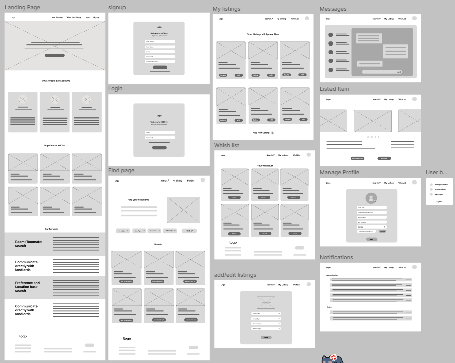
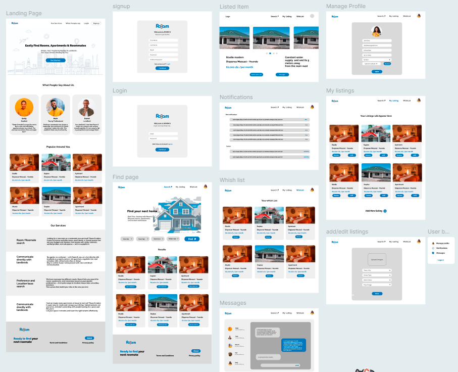

## **Competitive Audit Report and Design: Room 8**

## **1\. Goal**

Compare the UI, user experience, and features offered by each competitor in the rental property market.

## **2\. Competitors Analyzed**

1. **HousingAnywhere.com**
2. **DigitalRenter.com**

## **3\. General Information**

### **3.1 HousingAnywhere.com**

- **Type:** Direct
- **Location:** Operates in over 30 countries, including the USA and some European countries.
- **Product Offering:**
  - International focus.
  - Property advertisement and listing.
  - Multimedia listings (photos, videos, detailed descriptions).
- **Target Audience:**
  - Experts relocating for work.
  - Landlords and property owners.
  - Young professionals.
  - Interns.
  - Families relocating internationally or from one state to another.
- **Unique Value Proposition:**  
    "HousingAnywhere streamlines the medium to long-term international rental process by providing a secure and efficient online platform that connects tenants with diverse accommodation options and enables landlords to reach a global audience."

### **3.2 DigitalRenter.com**

- **Type:** Direct
- **Location:** Cameroon
- **Product Offering:**
  - Search based on preferences.
  - Property advertisement and listing.
  - In-app messaging with property owners and clients.
  - Reviews and user feedback.
- **Target Audience:**
  - Students seeking affordable rooms near universities.
  - Families looking for spacious, long-term rentals.
  - Landlords and property owners.
  - Companies and startups searching for office space.
- **Unique Value Proposition:**  
    "DigitalRenter connects tenants and landlords by simplifying the rental process. For tenants, it offers easy access to listings with search tools. For landlords, it automates listing, tenant screening, and communication, reducing vacancy periods."

## **4\. User Experience Evaluation**

### **4.1 HousingAnywhere.com**

| **Category** | **Rating** |
| --- | --- |
| First Impression | Good (Visually appealing) |
| App Interaction | Good |
| Features | Good |
| Accessibility | Good |
| User Flow | Very Good |
| Navigation | Very Good |
| App Visual Design | Very Good |
| Brand Identity | Very Good |
| Tone | Good |
| Descriptiveness | Okay |

###

**4.2 DigitalRenter.com**

| **Category** | **Rating** |
| --- | --- |
| First Impression | Okay & Needs Work (UI needs improvement) |
| App Interaction | Good |
| Features | Needs Work |
| Accessibility | Okay |
| User Flow | Okay |
| Navigation | Okay |
| App Visual Design | Okay |
| Brand Identity | Okay |
| Tone | Good |
| Descriptiveness | Okay |

## **5\. Key Findings**

1. **HousingAnywhere.com** excels in user experience, visual design, and navigation, making it a strong competitor for international rentals.
2. **DigitalRenter.com** has functional features but requires improvements in UI, accessibility, and user flow to enhance its competitiveness.
3. **Condclusion** Both platforms serve landlords and tenants but cater to different geographic markets (international vs local).

## **6\. Recommendations**

### **6.1 For HousingAnywhere.com**

Improve descriptiveness of content to provide clearer property details.

### **6.2 For DigitalRenter.com**

- Revise the UI to make it more visually appealing.
- Enhance accessibility and streamline user flow for a smoother experience.
- Invest in better navigation tools to compete with higher-rated platforms.

## **7\. Proposed Ui for Room 8**

### **Color choice**

- **Blue (accent color)**

Signifies: Trust, calmness, professionalism and reliability

Encourages a sense of security and confidence.

- **Grey (secondry color)**

Signifies: Neutrality, sophistication, balance, and formality.

Used for minimalistic and modern designs, often in backgrounds or text.

Creates a sleek, professional look without distracting users.

- **White (primary color)**

Signifies: Simplicity, cleanliness, purity, and openness.

Commonly used in backgrounds, spacing, and modern designs to enhance readability.

Promotes clarity, reduces eye strain, and makes content stand out.

### **Low fidelity Wireframes**

#### **Design link:**

<https://www.figma.com/design/2r2mZKXmSVHg44dSGMY1H8/Room-8?node-id=36-2&t=RTGBAnQjDZ2XEk0v-1>

### **High fidelity Wireframes**

#### **Design link:**

<https://www.figma.com/design/2r2mZKXmSVHg44dSGMY1H8/Room-8?node-id=36-2&t=RTGBAnQjDZ2XEk0v-1>