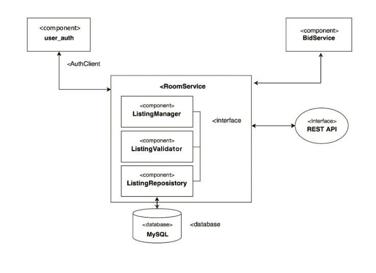

# RoomService Component Diagram Documentation #

## Overview ##
The `RoomService` is responsible for managing room listings in the system. It interacts with external services such as authentication and bidding systems, and handles validation, storage, and exposure of room listing data via REST APIs.

## Internal Components  

### 1. ListingManager `<component>`
- Handles all logic related to room listings (create, update, delete, retrieve).

### 2. ListingValidator `<component>`
- Validates room listing data

### 3. ListingRepository `<component>`
- Provides access to the MySQL database.

## Interfaces

### REST API `<interface>`
- External clients use this to interact with RoomService.
- Handles HTTP requests and maps them to internal logic via `ListingManager`.

### AuthClient -> user_auth `<component>`
- Used to validate users or fetch user information.

### BidService `<component>`
- May be called to fetch or manage room biding.

## Database

### MySQL `<database>`
- Stores all room listing data.
- Accessed via the `ListingRepository`.

## Communication Flow 

- REST API → RoomService (ListingManager)
- ListingManager <--> ListingValidator, ListingRepository
- `ListingRepository` <--> MySQL
- `AuthClient` <--> `user_auth`
- (Optional) `RoomService` <--> `BidService`

