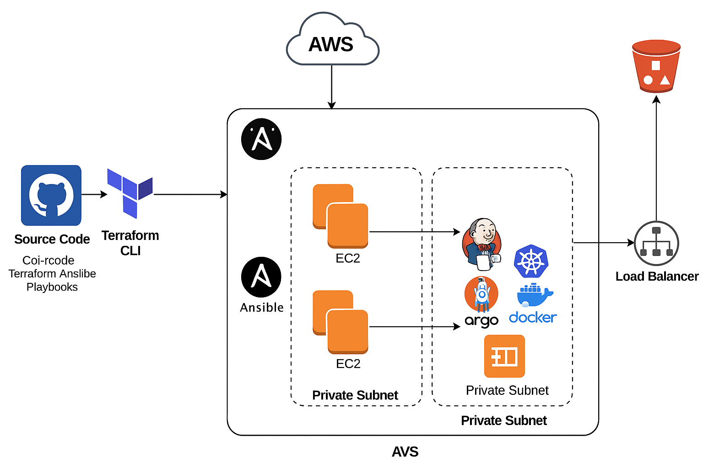

# Room8 DevOps Architecture (Manual Kubernetes + CI/CD)

This document outlines the infrastructure and DevOps workflow for deploying the Room8 microservice-based application using **AWS, Terraform, Ansible, Kubernetes, Jenkins, Docker, and ArgoCD**, following industry-standard practices.

---

## 🗂️ GitHub Repository Structure

```
room8/
├── backend/
├── frontend/
├── devops/
│   ├── ci/           # Jenkinsfiles, pipelines
│   ├── terraform/    # Terraform scripts for infra
│   ├── ansible/      # Playbooks and roles
│   ├── docker/       # Dockerfiles and Docker Compose files
│   ├── k8s/          # Kubernetes manifests
│   └── scripts/      # Helper bash or Python scripts
└── Documentation
└── README.md
```

---

## 🏗️ Infrastructure Architecture (Provisioned via Terraform)

- **VPC**
  - Public Subnets (x2)
  - Private Subnets (x2)
  - Route Tables, IGW, NAT Gateway
- **Bastion Host** (EC2 in public subnet)
  - SSH access to private EC2s
- **App Nodes** (EC2 in private subnets)
  - Hosts Jenkins, ArgoCD, Kubernetes cluster (via kubeadm), Docker
- **S3 Bucket**
  - Stores artifacts, Terraform state, etc.

> All infrastructure is provisioned using Terraform CLI locally.

---

## 🔧 Software Configuration (Provisioned via Ansible)

Once EC2s are up:

- **Bastion Host**
  - SSH configured to connect to private instances

- **Private App Nodes**
  - Install:
    - Java
    - Docker
    - Jenkins (CI tool)
    - Kubernetes (via `kubeadm`)
    - ArgoCD (GitOps CD tool)
    - NGINX ingress controller (for routing)

---

## 🚀 CI/CD Workflow Overview

### Continuous Integration: Jenkins

- Triggered by GitHub webhooks
- Pipeline steps:
  1. Clone repo
  2. Build (Java + React)
  3. Run tests
  4. Build Docker images
  5. Push to DockerHub or ECR

### Continuous Deployment: ArgoCD

- Deployed in Kubernetes cluster
- Monitors GitHub repo (k8s manifests)
- Automatically syncs changes into cluster

---

## ☸️ Kubernetes Architecture (Self-Managed)

- Initialized using `kubeadm` on EC2 nodes
- Core components:
  - Control Plane node (can be co-hosted or isolated)
  - Worker nodes for microservices
  - Ingress controller (NGINX)
  - ArgoCD + metrics (Prometheus, Grafana later)

---

## 🔐 Security & Networking

- Use SSH keys for Bastion access
- Security groups:
  - Bastion → Private EC2s (port 22)
  - Jenkins/ArgoCD → Internet (limited)
  - LoadBalancer → Ingress (port 80/443)
- NAT Gateway for private nodes' internet access

---

## 📈 Future Enhancements

- Add monitoring (Prometheus, Grafana)
- Secrets management (HashiCorp Vault or AWS Secrets Manager)
- Central logging (EFK or ELK stack)
- Horizontal autoscaling in K8s
- Transition to managed services (e.g., EKS, RDS)

---

## 📸 Architecture Diagram



---

## ✅ Summary

| Component         | Tool Used         |
|------------------|-------------------|
| Code Repo         | GitHub            |
| Infra Provisioning| Terraform         |
| Software Setup    | Ansible           |
| CI                | Jenkins           |
| CD                | ArgoCD            |
| Container Runtime | Docker            |
| Orchestration     | Kubernetes (manual setup via kubeadm) |

